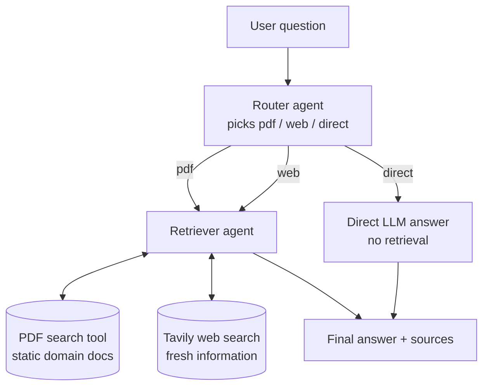

# Agentic RAG: Router–Retriever System with PDF and Web Search

A multi-agent question-answering system built with [CrewAI](https://docs.crewai.com). A **Router agent** classifies each question and chooses a retrieval path; a **Retriever agent** executes the retrieval from the chosen source and writes a grounded answer. Static, domain-specific knowledge comes from a PDF; fresh information comes from the web via Tavily; questions outside both are answered directly by the LLM without retrieval.

The static source in this project is *Attention Is All You Need* (Vaswani et al., 2017), the paper that introduced the Transformer architecture.

## Architecture



### Agents

| Agent | Tools | Responsibility |
|---|---|---|
| **Query Router** | none | Reads the question and returns a structured decision `{route, reason}` where `route` is one of `pdf`, `web`, `direct`. It never retrieves anything. |
| **Retriever and Answer Writer** | `PDFSearchTool`, `TavilySearchTool` | Uses only the tool the router chose, gathers evidence, and writes a concise answer with a *Sources* section. Says explicitly when the source does not contain the answer. |

### Retrieval paths

The router applies these rules in order and stops at the first match:

1. **`pdf`** — the question is about the Transformer architecture, attention, or anything else the paper covers, even if the question is basic. The PDF is the authoritative source for its topic.
2. **`web`** — the question needs current or time-sensitive information (news, prices, recent model releases, anything after 2017).
3. **`direct`** — the question is unrelated to the paper's topic and needs no fresh information.

| Example question | Route |
|---|---|
| What is self-attention? | `pdf` |
| How does multi-head attention work? | `pdf` |
| What is the latest GPT model? | `web` |
| What is photosynthesis? | `direct` |

### Orchestration

The pipeline is a **CrewAI Flow**. The `@router` decorator turns the Router agent's decision into a hard branch: only the chosen path executes, so a `direct` question never instantiates the Retriever crew.

```
receive_question  →  decide_route (Router crew)
                          ├─ "pdf"    → retrieve_from_pdf (Retriever crew + PDF tool)   ─┐
                          ├─ "web"    → retrieve_from_web (Retriever crew + Tavily tool) ─┼→ finalize
                          └─ "direct" → answer_directly   (plain LLM call)              ─┘
```

The router's output is validated against a Pydantic model (`RouteDecision`) with a `Literal["pdf", "web", "direct"]` field, so an invalid label cannot reach the branch logic.

## Project structure

```
.
├── pyproject.toml
├── requirements.txt
├── .env.example
├── data/
│   └── domain_docs.pdf          # the static source (not committed)
└── src/agentic_rag/
    ├── config.py                # env loading, paths, LLM factory, DOMAIN_DESCRIPTION
    ├── tools.py                 # PDFSearchTool + TavilySearchTool
    ├── schemas.py               # RouteDecision, RAGState
    ├── agents.py                # router_agent(), retriever_agent()
    ├── tasks.py                 # router_task(), retriever_task()
    ├── flow.py                  # AgenticRAGFlow + ask() helper
    └── main.py                  # CLI entry point
```

## Setup

Requires Python 3.10–3.12.

```bash
git clone <repo-url>
cd <repo-folder>

python -m venv .venv
source .venv/bin/activate          # Windows: .venv\Scripts\activate

pip install -e .                   # or: pip install -r requirements.txt
cp .env.example .env               # then fill in your keys
```

`.env`:

```
OPENAI_API_KEY=sk-...
TAVILY_API_KEY=tvly-...
LLM_MODEL=openai/gpt-4o-mini
PDF_PATH=data/domain_docs.pdf
CREWAI_TRACING_ENABLED=true        # optional, see Observability
```

Place your PDF at `data/domain_docs.pdf` (or point `PDF_PATH` elsewhere). On first run `PDFSearchTool` chunks and embeds the document into a local vector store; subsequent runs reuse it.

## Usage

```bash
agentic-rag "What is self attention?"
# or
python -m agentic_rag.main "What is self attention?"
```

Output is a JSON object with the question, the chosen route, the router's reasoning, and the answer:

```json
{
  "question": "What is self attention?",
  "route": "pdf",
  "reason": "The question is about self-attention, which is covered in the paper.",
  "answer": "Self-attention is a mechanism used in neural networks ... \n\nSources: ..."
}
```

To render the flow graph as HTML:

```bash
agentic-rag --plot        # writes agentic_rag_flow.html
```

## Observability

The project uses CrewAI's built-in tracing, which records every flow step, crew, agent, tool call and LLM call with token counts and timings.

```bash
crewai login              # one-time browser auth with app.crewai.com
crewai traces enable
```

Traces then appear in the **Traces** tab at [app.crewai.com](https://app.crewai.com) after each run.

### Example trace: `What is self attention?`


| Step | What happened | Tokens | Time |
|---|---|---|---|
| `receive_question` | Question loaded into flow state | — | 7 ms |
| `decide_route` → Query Router | One LLM call; returned `{"route": "pdf", ...}` | 667 | 2.3 s |
| `retrieve_from_pdf` → Retriever | LLM call → `Search a PDF's content` tool → LLM call to write the answer | 290 + 4.6K | 11.2 s |
| `finalize` | Assembled the result object | — | <1 ms |
| **Total** | 14 events, 2 crews | **5.6K** | **13.5 s** |

The trace shows the intended shape: exactly one routing call, then only the chosen branch. The 4.6K-token second Retriever call is the answer-writing step, which includes the retrieved PDF chunks in its context — this is where most of the cost of a `pdf` question goes. A `direct` question, by comparison, costs roughly 600 tokens in total.

## Design notes

- **Router has no tools.** Keeping decision and execution in separate agents makes the routing auditable (the `reason` field is logged in every trace) and lets the two be tuned independently.
- **Rule precedence matters.** An early version of the router prompt let "general concept" questions go to `direct`, which sent *What is a Transformer?* past the PDF. Ordering the rules with `pdf` first and adding few-shot examples fixed it.
- **Structured routing output.** Using `output_pydantic` on the router task removes any string parsing and guarantees a valid branch label.
- **Flows over a sequential Crew.** A plain sequential crew can only *suggest* a route via task context; a Flow with `@router` enforces it.

## Possible extensions

- Add a `Streamlit` UI on top of `ask()` (`pip install -e ".[ui]"`).
- Route to multiple sources for questions that need both static context and fresh information.
- Add an evaluation set of labelled questions to measure routing accuracy.
- Swap the embedder / vector store in `PDFSearchTool` via its `config` argument.

